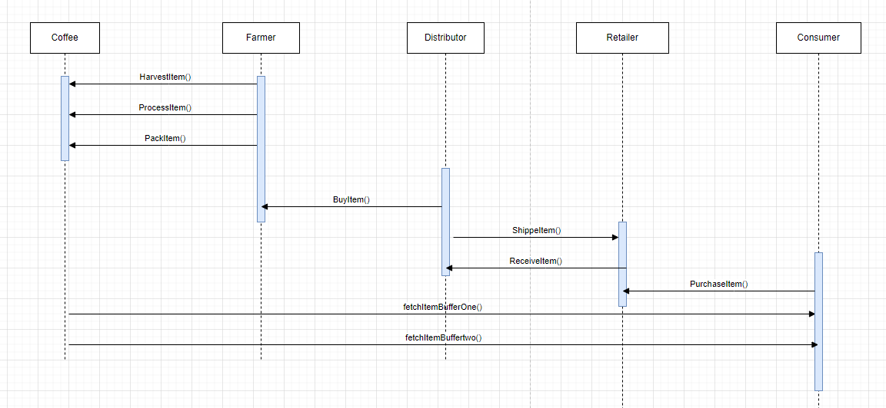
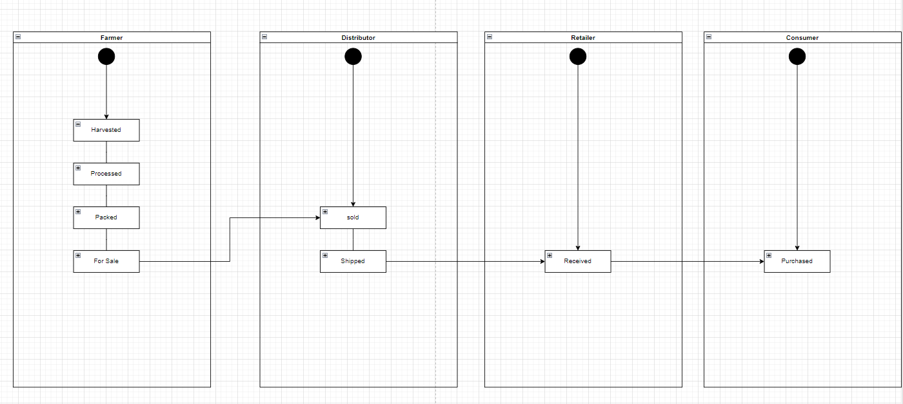
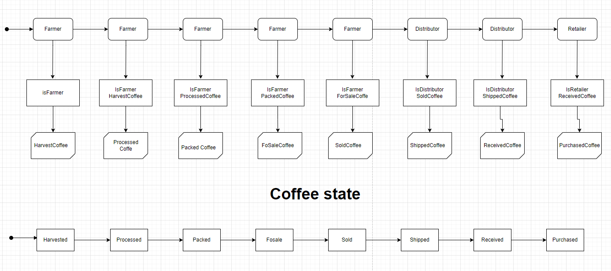
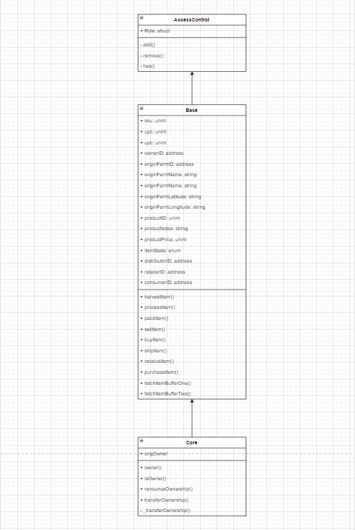

# Supply chain & data auditing

This repository containts an Ethereum DApp that demonstrates a Supply Chain flow between a Seller and Buyer. The user story is similar to any commonly used supply chain process. A Seller can add items to the inventory system stored in the blockchain. A Buyer can purchase such items from the inventory system. Additionally a Seller can mark an item as Shipped, and similarly a Buyer can mark an item as Received.

The DApp User Interface when running should look like...


## Getting Started

These instructions will get you a copy of the project up and running on your local machine for development and testing purposes. 
See deployment for notes on how to deploy the project on a live system.

### Contract adressess
I have already deployed this project on public test rinkeby network. You will find below basic information about it:

1. **token public rinkeby addresses** :


> 0x6dba1d8a4e92ea544442e290da761384e8d05314 [click here](https://rinkeby.etherscan.io/address/0x6dba1d8a4e92ea544442e290da761384e8d05314)
> 0xb4adc4e03c7717cad8c00502c5939430723570f4 [click here](https://rinkeby.etherscan.io/address/0xb4adc4e03c7717cad8c00502c5939430723570f4)
> 0xa8a5fec767c7cf739e4b46eeb3aeba0d95983766 [click here](https://rinkeby.etherscan.io/address/0xa8a5fec767c7cf739e4b46eeb3aeba0d95983766)
> 0x6652cfac6d7682d5a2b07ff265ddf79a62658637 [click here](https://rinkeby.etherscan.io/address/0x6652cfac6d7682d5a2b07ff265ddf79a62658637)
> 0x79be4ef1d7cba312f05949b58a976da0c4774b39 [click here](https://rinkeby.etherscan.io/address/0x79be4ef1d7cba312f05949b58a976da0c4774b39)
> 0x9c313d28789cfb1ac220a8769d9f25c28e053282 [click here](https://rinkeby.etherscan.io/address/0x9c313d28789cfb1ac220a8769d9f25c28e053282)

### Libraries
libraries used :
1. **openzeppelin-solidity(2.2.0)**: A library for secure smart contract development
2. **truffle-hdwallet-provider(1.0.17)**: HD Wallet-enabled Web3 provider. Use it to sign transactions for addresses derived from a 12 or 24 word mnemonic.
3. **truffle-contract(4.0.31)**: Better Ethereum contract abstraction, for Node and the browser.
4. **web3(0.20.6)**: This is the Ethereum JavaScript API which connects to the Generic JSON-RPC spec.

### Prerequisites

Please make sure you've already installed **ganache-cli**, **Truffle(v4.1.14)**, **node(v15.12.0)** and enabled MetaMask extension in your browser.

```
Give examples (to be clarified)
```

### Installing

> code is written for **Solidity v0.4.24**. At the time of writing, the current Truffle v5 comes with Solidity v0.5 that requires function *mutability* and *visibility* to be specified (please refer to Solidity [documentation](https://docs.soliditylang.org/en/v0.5.0/050-breaking-changes.html) for more details). To use this starter code, please run `npm i -g truffle@4.1.14` to install Truffle v4 with Solidity v0.4.24. 

A step by step series of examples that tell you have to get a development env running

Clone this repository:

```
git clone https://github.com/udacity/nd1309/tree/master/course-5/project-6
```

Change directory to ```project-6``` folder and install all requisite npm packages (as listed in ```package.json```):

```
cd project-6
npm install
```

Launch Ganache:

```
ganache-cli -m "spirit supply whale amount human item harsh scare congress discover talent hamster"
```

Your terminal should look something like this:


In a separate terminal window, Compile smart contracts:

```
truffle compile
```

Your terminal should look something like this:


This will create the smart contract artifacts in folder ```build\contracts```.

Migrate smart contracts to the locally running blockchain, ganache-cli:

```
truffle migrate
```

Your terminal should look something like this:


Test smart contracts:

```
truffle test
```

All 10 tests should pass.


In a separate terminal window, launch the DApp:

```
npm run dev
```

## Sequence diagram



## Activity diagram



## State diagram




## Class diagram



## Built With

* [Ethereum](https://www.ethereum.org/) - Ethereum is a decentralized platform that runs smart contracts
to make the web faster, safer, and more open.
* [Truffle Framework](http://truffleframework.com/) - Truffle is the most popular development framework for Ethereum with a mission to make your life a whole lot easier.


## Authors

**twitter**: martialo dev [follow me](https://twitter.com/martialobug)

**instagram**: martialo dev [follow me](https://www.instagram.com/martialo_dev/)

## Acknowledgments

* Solidity
* Ganache-cli
* Truffle
* Template code from @udacity/active-public-content
